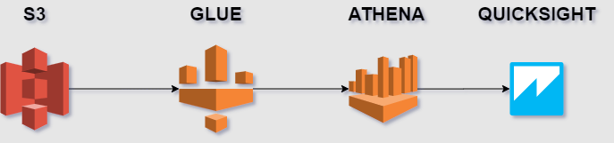

# Data engineering case study and pipeline flow for the data from the NYC Taxi Trips dataset

# Overview AWS Solution
How to leverage Amazon S3, Amazon Glue, Amazon Athena and Amazon QuickSight, automate the creation of a data catalog, 
transform data to a compressed columnar format that allows to speed up and reduce the cost of query/analysis

This is a serverless furthermore without worry about or having to manage clusters or having to spin up a single instance.

Also all dev environment, shell and text editor used are serverless too thanks Amazon Cloud9 solution.

# Services in use:

- [AWS S3](https://aws.amazon.com/s3/) for data storage
- [AWS Glue](https://aws.amazon.com/pt/glue/) for data catalog automation and ETL from S3 with csv and json files provided
- [AWS Athena](https://aws.amazon.com/pt/athena/) Blazing fast mult propose and serverless query engine base on Apache/Facebook Presto
- [Amazon QuickSight](https://aws.amazon.com/quicksight/) for data visualization


## Data Used

- [Taxi Trips data in New York City 2009](https://s3.amazonaws.com/data-sprints-eng-test/data-sample_data-nyctaxi-trips-2009-json_corrigido.json) 
- [Taxi Trips data in New York City 2010](https://s3.amazonaws.com/data-sprints-eng-test/data-sample_data-nyctaxi-trips-2010-json_corrigido.json)
- [Taxi Trips data in New York City 2011](https://s3.amazonaws.com/data-sprints-eng-test/data-sample_data-nyctaxi-trips-2011-json_corrigido.json)
- [Taxi Trips data in New York City 2012](https://s3.amazonaws.com/data-sprints-eng-test/data-sample_data-nyctaxi-trips-2012-json_corrigido.json) 
- [Vendor Loockup](https://s3.amazonaws.com/data-sprints-eng-test/data-sample_data-nyctaxi-trips-2012-json_corrigido.json)
- [Payment Loockup](https://s3.amazonaws.com/data-sprints-eng-test/data-sample_data-nyctaxi-trips-2012-json_corrigido.json) 

# [Architecture overview](#architecture-overview)
# [Prerequisites](#prerequisites)
# [Walkthrough to reproduce the analysis](#the-setup)

## Architecture overview



## Prerequisites

For this experiment, you will need the following:

- The [AWS CLI](https://docs.aws.amazon.com/cli/latest/userguide/cli-chap-install.html)
- An AWS account. [here](https://portal.aws.amazon.com/billing/signup/iam).

## The Setup 

### Main steps

### 1 - Upload a dataset to Amazon S3
### 2 - Create a Data Catalog and squemas for each dataset in S3 by AWS Glue
### 3 - Transform data in tables using Apache Parquet, a compressed columnar format

### Actions to take to anwers the questions (detailed):

1. App download and datasets form URL intercafes for S3 files
2. App upload files into Amazon S3
3. ETL and Data Catalog: Amazon Glue 
    - Crawlers read csv and json files, generate schemas and create data catalogs for each dataset
    - PySpark jobs in Glue tranform data into parquet format by extrnal table creation 
    - Pyspark jobs in Glue merge trips files/datasets in one table
4. Data discover and quering by Amazon Athena based on database and tables creted by Glue  
5. Visualization:
    - Amazon Quick Sights allows reporting on datasets directly with custom queries in Athena databases.


```bash
python3 app.py
```

```python
    base_url = "https://s3.amazonaws.com/data-sprints-eng-test/"
    bucket_name = 'de-bera-nyc-cab-trips'
    payloads = [
        ("data-files/data-nyctaxi-trips-2009.json", base_url + "data-sample_data-nyctaxi-trips-2009-json_corrigido.json"),
        ("data-files/data-nyctaxi-trips-2010.json", base_url + "data-sample_data-nyctaxi-trips-2010-json_corrigido.json"),
        ("data-files/data-nyctaxi-trips-2011.json", base_url + "data-sample_data-nyctaxi-trips-2011-json_corrigido.json"),
        ("data-files/data-nyctaxi-trips-2012.json", base_url + "data-sample_data-nyctaxi-trips-2012-json_corrigido.json"),
        ("data-files/data-vendor_lookup.csv", base_url + "data-vendor_lookup-csv.csv"),
        ("data-files/data-payment_lookup.csv", base_url + "data-payment_lookup-csv.csv")
    ]

    for entry in payloads:
        fetch_jsons(entry)
        upload_file(entry[0],bucket_name)  
```


## [Analysis Review: For each question the related solution with explanations and evidences](analysis.html)

## References:
Installing the AWS CLI
https://docs.aws.amazon.com/cli/latest/userguide/installing.html

Configuring the AWS CLI
https://docs.aws.amazon.com/cli/latest/userguide/cli-chap-getting-started.html

AWS Glue Built-in classifiers
https://docs.aws.amazon.com/glue/latest/dg/add-classifier.html#classifier-built-in

Parquet data format
https://parquet.apache.org/documentation/latest/

Setting up QuickSight
https://docs.aws.amazon.com/quicksight/latest/user/signing-in.html
